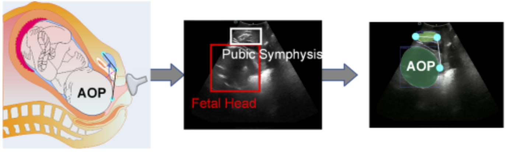
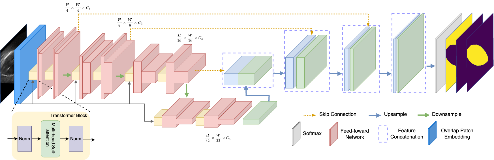

# MiTU-Net


## Introduction
The high risk of maternal and perinatal morbidity is associated with longer labor duration due to the slow progression of fetal descent, but accurate assessment of fetal descent by monitoring the fetal head (FH) station remains a clinical challenge in guiding obstetric management. Based on clinical findings, the transvaginal digital examination is the most commonly used clinical estimation method of fetal station. However, this traditional approach is very subjective, often difficult, and unreliable. The need of an objective diagnosis found its solution in the use of transperineal ultrasound (TPU) able to assess FH station by measuring the angle of progression (AoP) that is the extension the FH goes through in its descent. Benefits of automated measurement of biometry: Reduce subjectivity and Reduce non-repeatability. A pubic symphysis-fetal head dataset is desired for development of algorithms. The Challenge: segment fetal head (FH)-pubic symphysis (PS) and then compute angle of progression (AOP) based on the segmented FH-PS.


_Figure 1. Example of reference organ-at-risk (OAR) segmentations, displayed as color-coded three-dimensional binary masks._

## Datasets
**Pubic Symphysis-Fetal Head Segmentation and Angle of Progression** [1]
* Training data consisting of 4000 manually segmented cases is publically available on [Zenodo](https://zenodo.org/record/7851339).
* Preliminary Test Phase (401 test cases): Participants develop their methods and test them on a subset of the test set. 
* Final Test Phase (700 test cases): Participants submit their final methods and test them on a full test set. 

## Network Architecture
Our U-Net [3] architecture contains the contracting path ("encoder") and the expansive path ("decoder"). They both have the same depth of four layers. Between encoder and decoder, we use skip connections to concatenating features from the Mix Transformer [2] encoder to recover spatial information lost during downsampling. We first transpose the original ultrasound image of size $3 × 256 × 256$ to size of $256 × 256 × 3$. Then the Mix Transformer encoder divides the ultrasound image into small patches of size 4 × 4. These patches are the input to the Mix Transformer encoder to obtain multi-level features at ${\frac{1}{4}, \frac{1}{8}, \frac{1}{16}, \frac{1}{32}}$ of the original image resolution. The encoder passes the multi-level features to the decoder to predict the segmentation mask at a $\frac{H}{4} × \frac{W}{4} × N_{cls}$ resolution, where $N_{cls}$ is the number of categories. \


## Data Augmentation
* Rotation: random angle from $(−25°, 25°)$
* Vertically flip ($P(⋅) = 0.3$)
* Horizontally flip ($P(⋅) = 0.5$)
* Coarse Dropout [4] ($P(⋅) = 0.5$)
* Pixel normalization 
    * Mean: $[0.0, 0.0, 0.0]$
    * STD: $[1.0, 1.0, 1.0]$

## Training 
* Training Set: $4000$
* Epochs: $20$
* Batch Size: $10$
* Learning Rate: $1e-4$ 
* GPU: NVIDIA Tesla T4 

## Inference
Go to [Symphysis_Fetal_Head_Segmentation](Symphysis_Fetal_Head_Segmentation.ipynb) to extract the codes of evaluation to do inference. An example of inference code is as below:
```python
def load_checkpoint(checkpoint):
    print("=> Loading checkpoint")
    return torch.load(checkpoint)
  
model_prefix = 'unet_mit_b0_model_2808'
save_path = root_path + f'/models/'
checkpoint_name = save_path + f"{model_prefix}_model.pt"
model = load_checkpoint(checkpoint_name)

# check accuracy
check_accuracy(test_dataloader,
               model,
               test_pix_acc, test_dice_scores,
               device=DEVICE,
               is_train=False)
```

## Replicate Work
The source Python code is in [Symphysis_Fetal_Head_Segmentation](Symphysis_Fetal_Head_Segmentation.ipynb). Our network is built with [Segmentation Models Pytorch (SMP)](https://github.com/qubvel/segmentation_models.pytorch) library [5]. To replicate the results of our work, execute **Dataset Preparation** part and **Training Model** part sequencely.

## Reference
<a id="1">[1]</a> Lu, Y., Zhou, M., Zhi, D., Zhou, M., Jiang, X., Qiu, R., Ou, Z., Wang, H., Qiu, D., Zhong, M., Lu, X., Chen, G., & Bai, J. (2022). The JNU-IFM dataset for segmenting pubic symphysis-fetal head. Data in Brief, 41, 107904. \
<a id="2">[2]</a> Yu, X., Wang, J., Zhao, Y., & Gao, Y. (2023). Mix-ViT: Mixing attentive vision transformer for ultra-fine-grained visual categorization. Pattern Recognition, 135, 109131. \
<a id="3">[3]</a> Ronneberger, O., Fischer, P., Brox, T. (2015). U-Net: Convolutional Networks for Biomedical Image Segmentation. In: Navab, N., Hornegger, J., Wells, W., Frangi, A. (eds) Medical Image Computing and Computer-Assisted Intervention – MICCAI 2015. MICCAI 2015. Lecture Notes in Computer Science(), vol 9351. Springer, Cham. https://doi-org.ucd.idm.oclc.org/10.1007/978-3-319-24574-4_28 \
<a id="4">[4]</a> Terrance DeVries, & Graham W. Taylor. (2017). Improved Regularization of Convolutional Neural Networks with Cutout. \
<a id="5">[5]</a> Iakubovskii, P., "Segmentation Models Pytorch." (2019).